# Go serverless in Watson Assistant with IBM Cloud Functions

## WORKSHOP RESOURCES

- Login/Sign Up for IBM Cloud: https://ibm.biz/BdfMqU

Artificial intelligence (AI) is modernizing the world and changing the shape of every industry. It's a disruptive technology that's all around us in different applications. One of its main applications is as an intelligent chatbot that can get smarter over time to conduct a normal conversation with humans. With serverless computing, virtual assistants can do much more than answer simple questions. In this tutorial, learn how to use IBM&reg; Cloud Functions and IBM Cloud Object Storage to add more functions to chatbots so that they can perform advanced tasks.

## Learning objectives

The tutorial uses a telecommunications industry use case where users can ask the assistant for different mobile plans, and the assistant can use authentication to check the users' current data and transactions. The tutorial explains how the assistant gets information from a CSV file and how it can authenticate users. The CSV file contains mobiles plans information, and the authentication is hardcoded in the cloud function instead of using a real database to keep things simple. However, the assistant still needs to ask the user for an account number and OTP so it can use these credentials to authenticate.

After completing this tutorial, you understand how to:

* Work with IBM Watson&reg; Assistant
* Work with IBM Cloud&reg; Object Storage
* Use IBM Cloud Functions and integrate it with IBM Cloud Object Storage and Watson Assistant

## Prerequisites

To complete the tutorial, you need an [IBM Cloud](https://ibm.biz/BdfMqU) account. You can get a free trial account, which gives you access to IBM Cloud, Watson Assistant, and IBM Cloud Functions.

## Estimated time

It should take you approximately 60 minutes to complete this tutorial.

## Steps

Download the following assets:

* [plans.csv](static/plans.csv): This file is the CSV file that contains a sample of mobile plans.
* [cf-action.py](static/cf-action.py): This file is the Python code for the IBM Cloud Function.
* [dialog.json](static/dialog.json): This file is the dialog skill for Watson Assistant.

### Step 1: Create an IBM Cloud Object Storage service

1. Log in to your [IBM Cloud account](https://cloud.ibm.com/registration?cm_mmc=Inpersondirected-_-Audience+Developer_Developer+Conversation-_-WW_WW-_-Jan2021-khalil_faraj-go_serverless_in_watson_assistant_with_ibm_cloud_function-global-devadvgrp-dubai&cm_mmca1=000039JL&cm_mmca2=10010797&cm_sp=ibmdev-_-developer-tutorials-_-cloudreg).
1. Click **Create resource**, and search for Cloud Object Storage.

    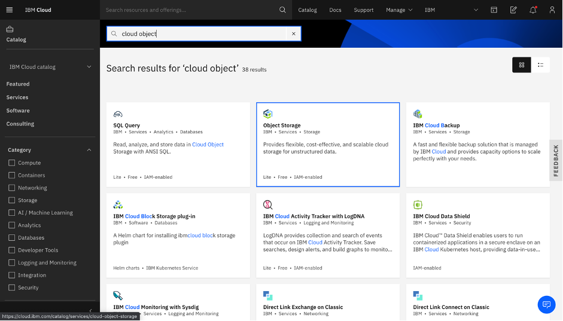

1. Choose the free Lite plan, change the name if you want, and click **Create**.

    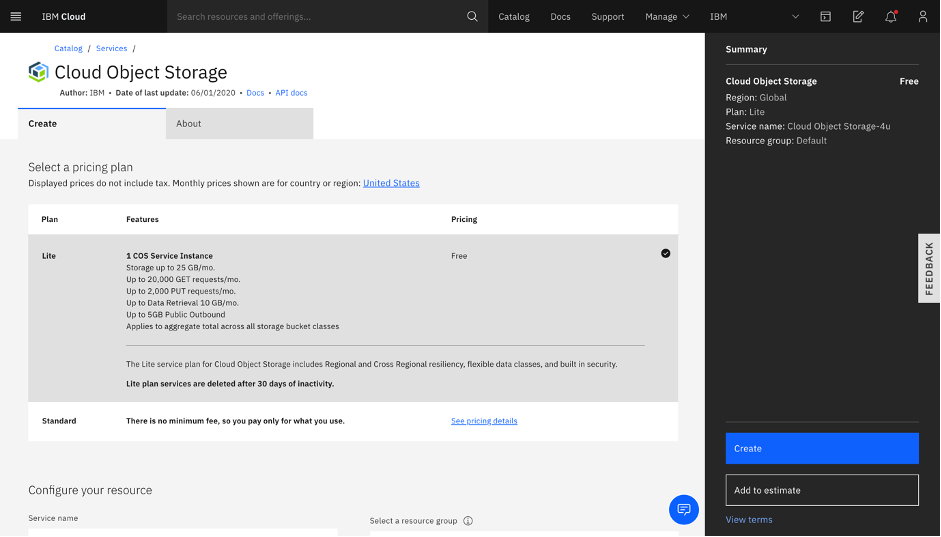

    You can now find the Cloud Object Storage instance created in resources under Storage.

1. Open your instance, click **Buckets**, then click **Create bucket** (you can choose any type of bucket). Make sure to note the name of your bucket after you create it.

    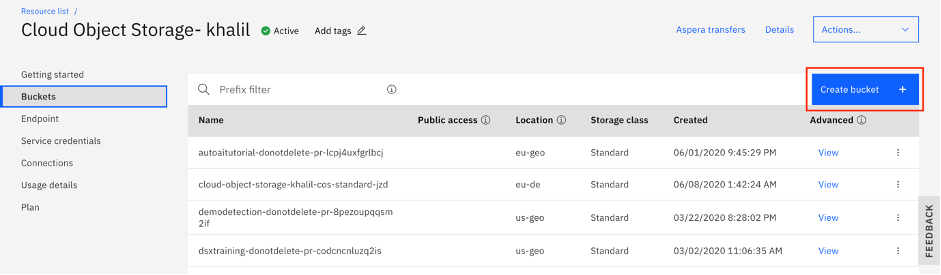

1. After your bucket is created, open it, and upload the [plans.csv](static/plans.csv) file.

1. Go to **Access Policies** in your bucket and click **Public Access**. Then, click **Create access policy**. This makes the bucket accessible to anyone (this bucket is public only for the purpose of this tutorial).

     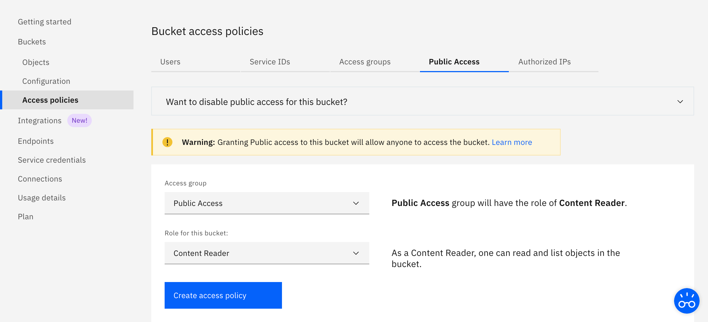

1. Go to **Service Credentials**, and select the service credential that was just created. If nothing is showing, then click **New credential** to generate one. Click the arrow to expand the credentials, and note the `api_key`, `iam_serviceid_crn`, and `resource_instance_id`.

    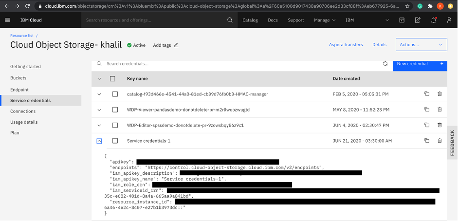

1. Go to **Endpoints**, and choose your resiliency and location. Note the Private url because you'll need it for the other steps.

    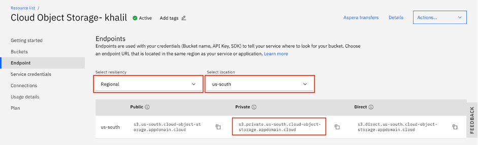

### Step 2: Create an IBM Cloud Function

1. Go back to the IBM Cloud main dashboard, and click the **Functions** icon.

    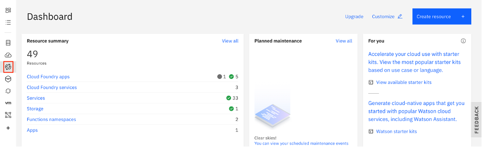

1. Click **Start Creating**.

    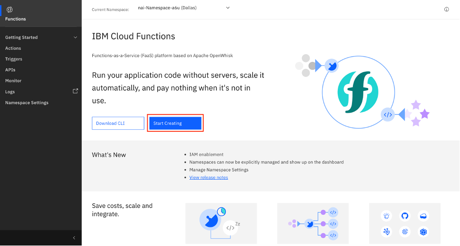

1. Click Action.

    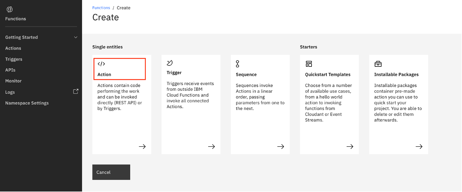

1. Name your Action, choose Python 3.7 as the runtime environment, and click **Create**.

    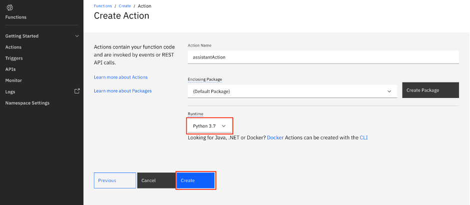

1. Copy the code from the [cf-action.py](static/cf-action.py), and put it in the action that you just created, and click **Save**.

    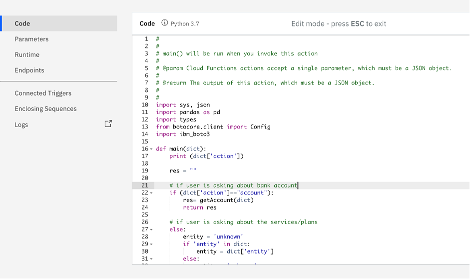

1. Click **Parameters** and create five parameters, making sure that you name them exactly like the following image because you are using them in the code. Fill `api_key`, `service_instance_id`, and the `endpoint_url` with the values that you noted earlier when you created the Cloud Object Storage instance. Add the name of your bucket, and enter `plans.csv` for `file_name` (because the file you uploaded earlier in the object storage is named plans.csv, so you must make sure that you put the same name in case you renamed the file) . Click **Save**.

    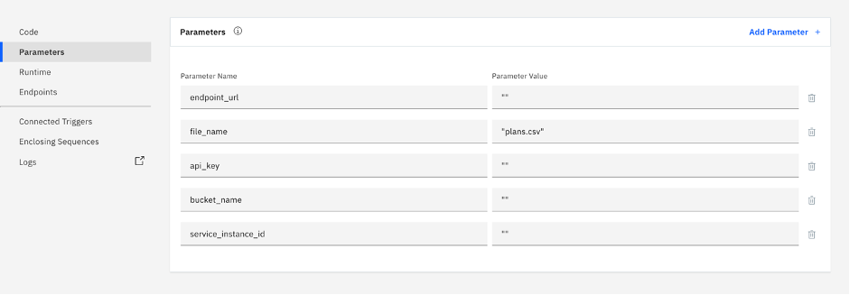

1. Click **Endpoints**, **Enable as Web Action**, then click **Save**. Note the Public URL. You use this url to connect your assistant with this cloud function.

    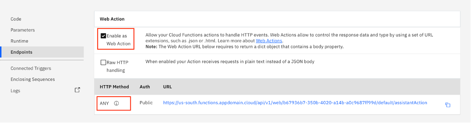

### Step 3: Create a Watson Assistant service

1. Go back to the IBM Cloud main dashboard, and click **Create resource**.

    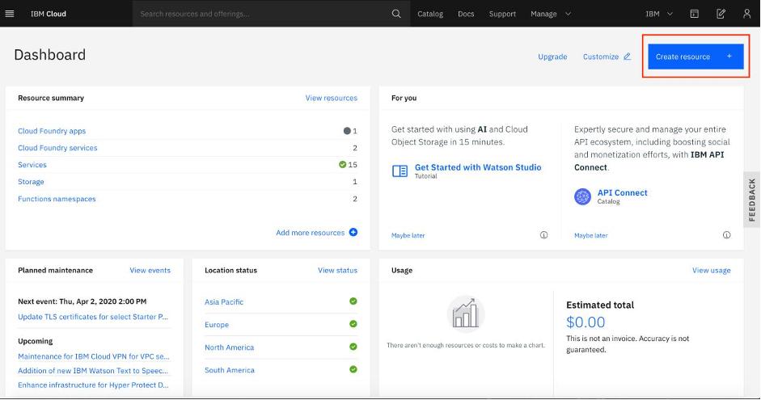

1. Select **Services**, then select **AI/Machine Learning**. You see all of the AI services available on IBM cloud. In this tutorial, you'll select **Watson Assistant**. (You can also search for Watson Assistant in the search bar.)

    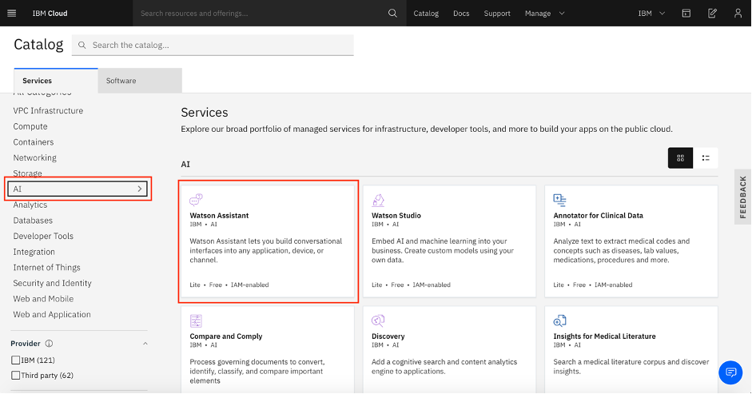

1. Choose a region, and select the Lite plan.

    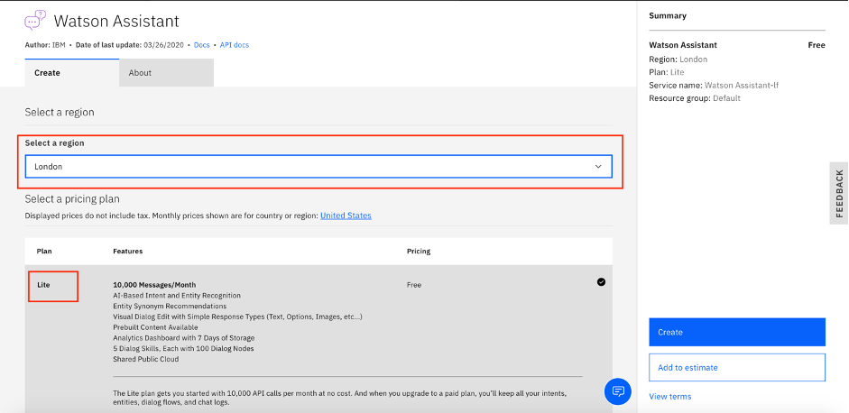

1. At the bottom of the page, you see Configure your resource. Here, you can name your service (the name must be unique), choose a resource group, and add tags so that you can easily search for your services (this is optional). When you're done, click **Create**.

    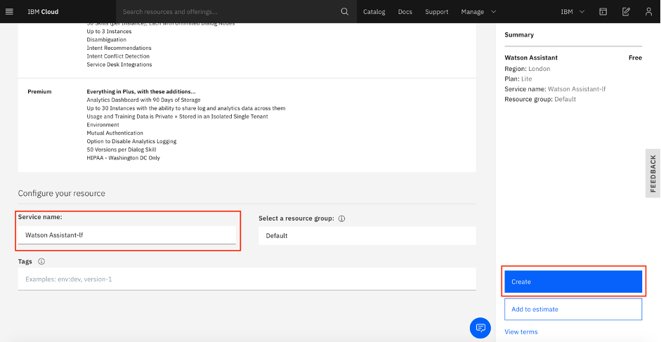

1. Click **Launch Watson Assistant**.

    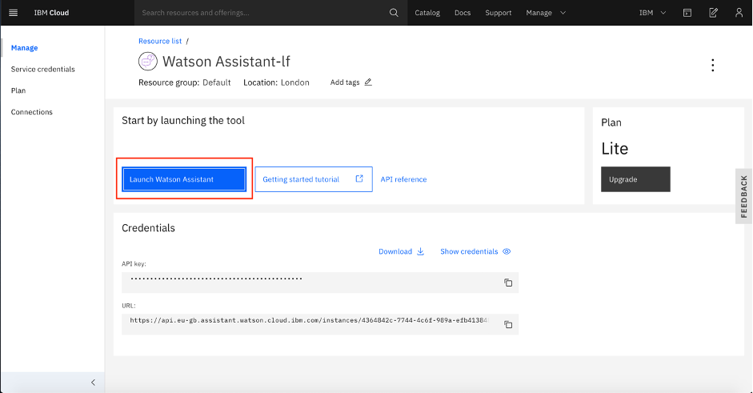

1. When you are in the Watson Assistant tool, you see a default assistant called My first assistant. However, you are going to create your own assistant, so click **Create Assistant**.

    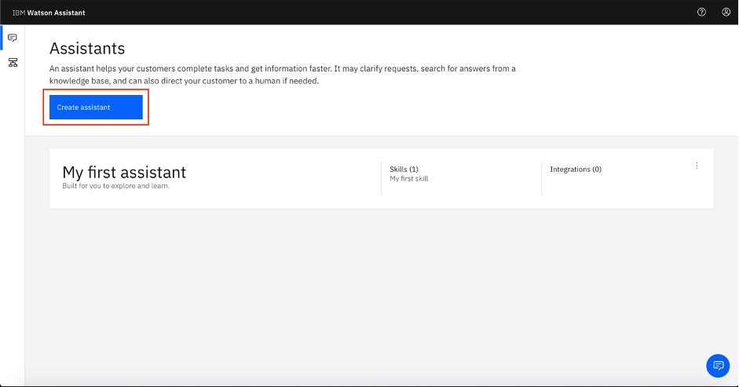

1. Name your assistant. Optionally, you can write a small description about your assistant. Click **Create**.

    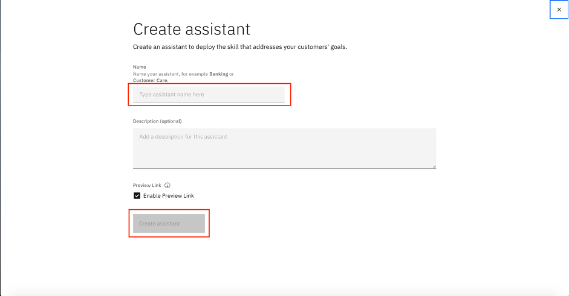

### Step 4: Create a dialog skill for the assistant

1. Every assistant in Watson Assistant needs a dialog skill so that it can communicate with people. Click **Add dialog skill**.

    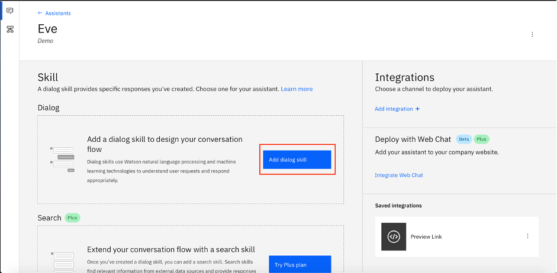

1. You can add an existing skill, use sample skills that come with Watson Assistant, import a skill, or create a new one. Choose **Import skill**, and select the dialog.json file that you downloaded. Click **Import**.

    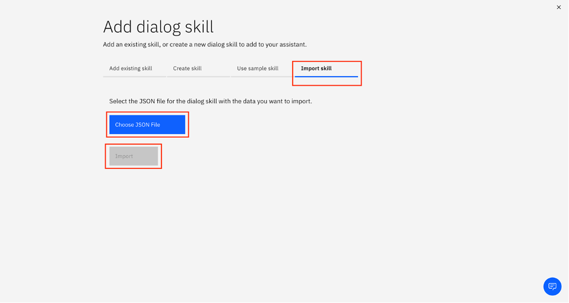

1. After the file is imported, you see the following dialog structure in addition to the entities and intents.

    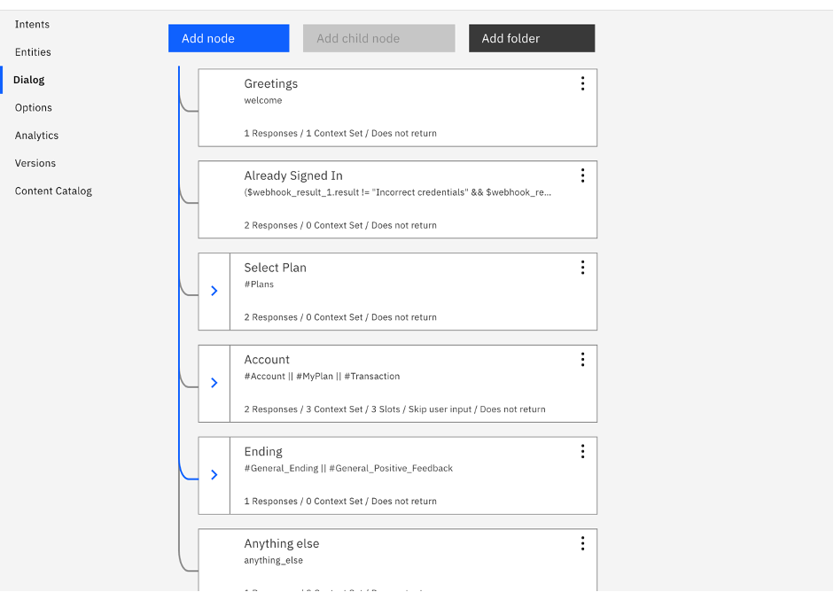

### Step 5: Create a webhook

1. Go back to your assistant and open it. Click **Options**, then click **Webhooks**. Insert the Public URL that you received earlier from the Cloud Function, and add .json to the end.

    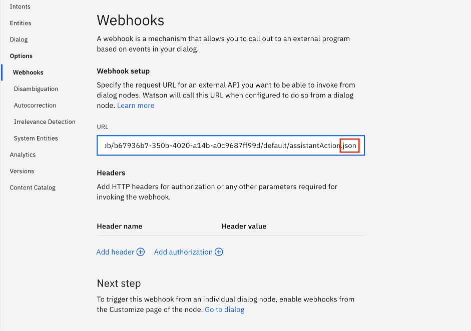

1. Because you have already imported the dialog skill, the webhook is already enabled on specific nodes, so you don't need to enable them. However, if you are creating your dialog from scratch, click the node where you want to enable the webhook, click **Customize**, and then enable the webhook by turning it On.

The assistant is now ready, and it's connected to the action in IBM Cloud Functions. The action has two functions:

* Authentication
* Getting the corresponding mobile plan information from the CSV file stored in the Cloud Object Storage

Because there are two functions in the same action, you use a parameter field to tell the action which part to run. If the parameter has the value account, then runs the authentication code. If it doesn't, then it means that the user is asking about the mobile plans, so it runs the other part.

In the authentication, the assistant asks the user for the account number and OTP. These are stored and passed to the webhook as parameters so that the Cloud Function can use them. The same concept happens with queries regarding the mobile plans, where the specified plan name is passed as the parameter so that the Cloud Function can get its corresponding information from the Microsoft&reg; Excel sheet.

For the authentication, the data is hardcoded in the code, so if you want to check an account, you can either enter 11111111 for an account number and 123 for the OTP or 22222222 and 456.

## Summary

In this tutorial, you learned how to extend a chatbot's capabilities with the power of serverless. Using IBM Cloud Functions in this example, the assistant can fetch information from a CSV file that is stored in a Cloud Object Storage and can perform authentication. The webhook connects the assistant to the Cloud Function and passes to it any specified parameters to run the action.

* If the user asks a query regarding mobile plans or a query that needs user authentication, the assistant triggers the Cloud Function. The action in the Cloud Function checks which part to run (authentication or mobile plans) based on the parameter that was passed from the assistant when the user entering the query.

* If the query is regarding a mobile plan, then the function accesses a file in Cloud Object Storage, reads from it, and gets the corresponding information so that it can send it back to the assistant, and then to the user.
